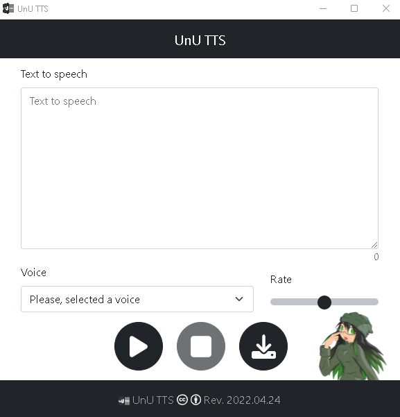

# UnU TTS (a desktop voice app)

 

# About UnU TTS

This project (<strong>UnU TTS</strong>) was developed  with <strong>NodeJS 16.14.2 LTS</strong>. <strong>UnU TTS</strong> is a desktop voice app to Windows Operating System that implement <i>“Say.js”</i> (a NodeJs library) to provide the functionality to convert <strong>Text to Speech</strong>.

 

## Usage

To run this project, first you must download it and, in the root of it, run the command <i>“npm install”</i>. So, after all dependencies was installed, run the command <i>“npm start”</i>.

 

## Compile

To compile the project and generate the <i>“Exe file”</i> you must execute the command <i>“npm run build-electron”</i>. This generate the folder <i>“dist”</i> where will locate the <i>“Exe file”</i> and their dependencies.

 

 

*******
## Credits

This repository belongs to < *Jorge Luis Jácome Domínguez* >.

###### Contact means < [Linkedin](https://www.linkedin.com/in/jorge-luis-jacome-dominguez-44294a91/) - [Dibujando](https://dibujando.net/soragefroren) - [Facebook](https://www.facebook.com/SoraGefroren) - [Youtube](https://www.youtube.com/c/SoraGefroren) >